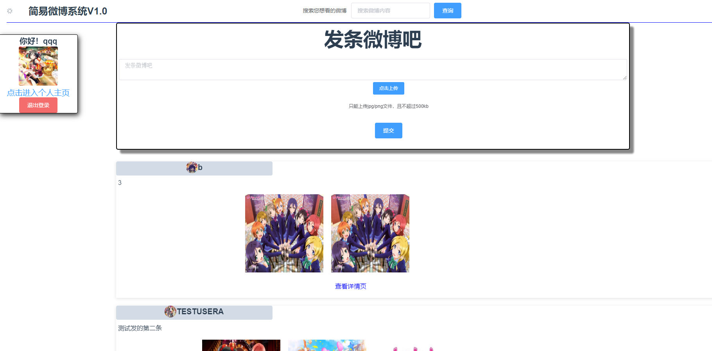
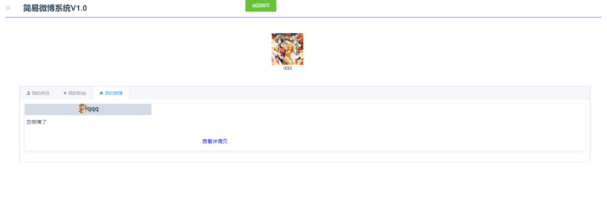

# weibo

## Project setup
```
npm install
```

### Compiles and hot-reloads for development
```
npm run serve
```

### Compiles and minifies for production
```
npm run build
```

### Run your tests
```
npm run test
```

### Lints and fixes files
```
npm run lint
```

### Customize configuration
See [Configuration Reference](https://cli.vuejs.org/config/).

# 大概预览

## 注册，登录


## 主页




## 自己的个人主页



## 微博的详情页面（点赞，评论），图片预览用的v-viewer


## 他人的详情页，可以进行关注操作


# 几个问题

## url改变页面不刷新数据

数据初始化放在了created（）的钩子函数里面

在watch中添加：

```
 '$route'(to, from) {
     console.log("改变");
      this.flash();
```

flash为刷新数据的函数

## 父组件异步传值给子组件

父组件还没有来得及获得数据，子组件就开始自己渲染，渲染出空的页面

### 解决一

在子组件渲染前，判断父组件数据是否获取完成，数据获取完成后再渲染子组件

```
tab-weekly(v-if="userId", :userId="userId")
```

### 解决二

把数据放到watch里面

```
props: ['floorGoods'],
      data() {
        return{
          flGoods: {}
        }
      },
      watch: {
        floorGoods(val) {
          this.flGoods = val;
          console.log(val);
        }
      }
```

得到数据再渲染

### 解决三

在父组件里面用promise方法异步执行数据的赋值

```
new Promise((resolve,reject) => {
          if (res.status === 200){
            resolve(res);
          }
        }).then((res) => {
          this.category = res.data.data.category;
          this.adBar = res.data.data.advertesPicture.PICTURE_ADDRESS;
          this.bannerSwipePics = res.data.data.slides;
          this.recommendGoods = res.data.data.recommend;
          // 也可异步获取再传给子组件 Promise
          this.floorSeafood = res.data.data.floor1;
          this.floorBeverage = res.data.data.floor2;
          this.floorFruits = res.data.data.floor3;
          console.log(this.floorFruits);
          this._initScroll();
        })
      }).catch(err => {
        console.log(err);
      });
```

## 路由传参

### params和query

query通过path切换路由，params通过name切换路由

```
// query通过path切换路由
<router-link :to="{path: 'Detail', query: { id: 1 }}">前往Detail页面</router-link>
// params通过name切换路由
<router-link :to="{name: 'Detail', params: { id: 1 }}">前往Detail页面</router-link>
```

### query通过this.$route.query接受，params通过this.$route.params接受

// query通过this.$route.query接收参数 created () {     const id = this.$route.query.id; }  // params通过this.$route.params来接收参数 created () {     const id = this.$route.params.id; }

### 展示方式

query传参的url展现方式：/detail?id=1&user=123&identity=1&更多参数

params＋动态路由的url方式：/detail/123

### params动态传参必须在路由中定义，且跳转时必须加上参数，否则为空白画面

### params刷新后会消失

## 路由权限的控制

设置路由元信息

```
    {
      path:"/WeiboDetail",
      name:"WeiboDetail",
      component:weibodetail,
      meta:{
        requiresAuth:true
      }
    },
    {
      path:"/MainPage",
      name:"MainPage",
      component:mainpage,
      meta:{
        requiresAuth:true
      }
    },
```

在beforeEach的钩子函数中进行判断，如果有token就允许访问，没有就自动重定向

```
router.beforeEach((to, from, next) => {
  let token = store.state.token; 
  console.log(token);
  if (to.meta.requiresAuth) {
   if (token) {
      next();
   } else {
    next({
     path: '/Login',
    });
   }
  } else{ 
   next();
  } 
  });
```

## 404页面的配置

```
    {
      path:"/404",
      name:"404",
      component:Error,
    },
```

放在所有路由最下面的配置

```
    {
        path:"*",
        redirect:"/404"
    },
```

## 使用axios

```
import axios from "axios"
```

```
Vue.prototype.$axios = axios;

```

## 接口的封装

在请求头里面放入自己的token

```
PostMsg.interceptors.request.use(
    config => {
   if (store.state.token) {
    config.headers.Authorization = `token ${store.state.token}`;
   }
   return config;
  }
 
 );
```

拦截返回的数据

```
PostMsg.interceptors.response.use(response=>{
  return response;
},error=>{
  if(error.response){
    switch(error.response.status){
      case 401:
          store.state.UserName=null; 
          store.state.token=null;
        alert("您的会话已经超时，请重新登陆");
        this.$router.replace("/Login")
    }
  }
})
```

